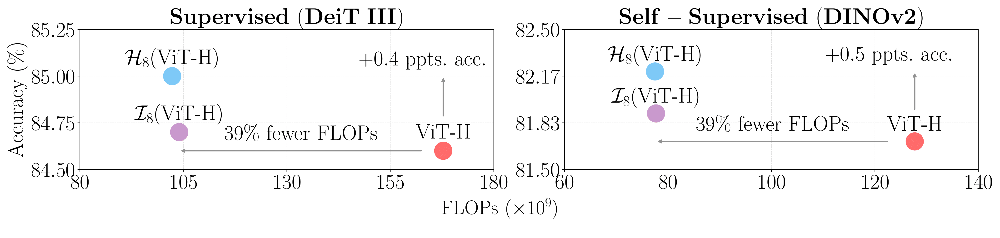

# 
<p align="center">
  <h1 align="center">Stronger ViTs With Octic Equivariance</h1>
  <p align="center">
    <a href="https://scholar.google.com/citations?user=-vJPE04AAAAJ">David Nordström</a>
    ·
    <a href="https://scholar.google.com/citations?user=Ul-vMR0AAAAJ&hl">Johan Edstedt</a>
    ·
    <a href="https://scholar.google.com/citations?user=P_w6UgMAAAAJ">Fredrik Kahl</a>
    .
    <a href="https://scholar.google.com/citations?user=FUE3Wd0AAAAJ">Georg Bökman</a>
  </p>
  <h2 align="center"><p>
    <a align="center">Paper</a>
  </p></h2>
  <div align="center"></div>
</p>
<br/>
<p align="center">
    
    <br>
    Using octic layers in ViTs significantly reduces the computational complexity while maintaining or improving classification accuracy on ImageNet-1K, for both supervised and self-supervised training.
</p>

## Structure

### Octic ViTs
In the `octic_vits` folder you find all the components to build octic-equivariant Vision Transformers (compatible with the [timm](https://github.com/huggingface/pytorch-image-models) library). 

### DeiT III
We base our code on the official [repo](https://github.com/facebookresearch/deit)

### DINOv2 
We base our code on the official [repo](https://github.com/facebookresearch/dinov2)

## Reproducing Results
Code to reproduce the experiments can be found in the [experiments folder](experiments).

### Training
We train on a cluster using [submitit](https://github.com/facebookincubator/submitit). So first you must set up the cluster settings in `octo/utils/cluster.py` and then you can simply run:
```bash
python experiments/train_octo.py --gpus 4 --nodes 4
```
### Testing
TBD

## License
TBD

## Cite
TBD
